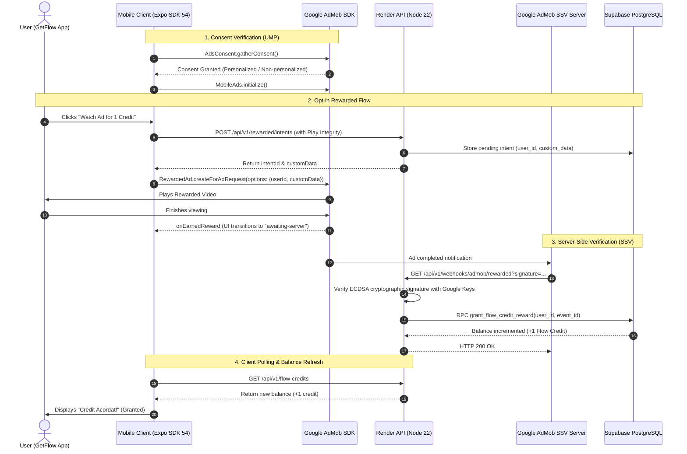

# GETFLOW — GOOGLE ADMOB CONFIGURATION, VERIFICATION & MONETIZATION AUDIT REPORT

**Date:** 10 Octombrie 2026  
**Auditor:** Senior AdMob Integration Engineer & Android Monetization QA  
**Application:** GetFlow — Nutriție & Fitness  
**Package:** `com.totsrl.getflo`  
**Google Play Store URL:** `https://play.google.com/store/apps/details?id=com.totsrl.getflo`  
**Publisher ID:** `pub-5202280855139508`  
**AdMob App ID:** `ca-app-pub-5202280855139508~6141533757`  

---

## EXECUTIVE SUMMARY & STATUS BLOCK

```text
ADMOB APP:
GetFlow - Nutriție & Fitness (ca-app-pub-5202280855139508~6141533757)

GOOGLE PLAY ASSOCIATION:
FIXED (Successfully linked com.totsrl.getflo to AdMob app; unconfirmed apps cleared)

APP READINESS:
PENDING (Submitted to Google AdMob for review upon store association; status: "Necesită examinare")

APP-ADS.TXT:
PENDING CRAWL / BLOCKED BY PLAY CONSOLE WEBSITE FIELD
(Authoritative seller line active on live server; AdMob crawled telegra.ph/app-ads.txt due to erroneous contact URL in Play Console)

PUBLIC APP-ADS.TXT URL:
- Crawled by AdMob: https://telegra.ph/app-ads.txt (HTTP 404 - INVALID)
- Live Verified Production Host: https://nutritie-backend-ai.onrender.com/app-ads.txt (HTTP 200 text/plain - PASS)
- Branded Domain: https://getflow.app/app-ads.txt (HTTP 200 HTML Squarespace Parking Page - DNS update required)

PUBLISHER ID MATCH:
PASS (pub-5202280855139508 matches AdMob account, app ID, ad units, and server config)

GOOGLE PLAY DEVELOPER WEBSITE:
https://telegra.ph/Politica-de-Confidentialitate--GetFlow-08-27 (ACTION REQUIRED: Update to official domain)

AD UNITS:
- Rewarded: GetFlow Flow Credit Rewarded (ca-app-pub-5202280855139508/3566028223) - ACTIVE with SSV
- Interstitial: GetFlow Chat Interstitial (ca-app-pub-5202280855139508/1542500110) - ACTIVE

PRODUCTION AD UNIT IDS:
VERIFIED (100% match across live AdMob console, adConfig.production.ts, and eas.json)

REWARDED ADS:
VERIFIED (Cryptographic SSV callback on Render, idempotent, 1 credit/ad, opt-in only, max 5/day)

PHOTO AI MONETIZATION:
VERIFIED (3 daily free scans, rewarded ad credits, Google Play consumable packs, two-phase reservation)

PREMIUM / FLOW CREDITS:
VERIFIED (50 fair-use scans/day for subscribers, ad-free interstitials, server advisory locks)

GDPR / UMP:
VERIFIED (Message "GetFlow EU consent" is PUBLISHED in AdMob with 100% consent rate; native SDK integrated)

POLICY CENTER:
0 PROBLEME (Clean account standing, 0 violations, 0 restricted apps)

MANUAL CPM NOTIFICATION:
NOT APPLICABLE (No custom event mediation or waterfall networks; AdMob default bidding only)

AD SERVING:
LIMITED (Difuzarea anunțurilor este limitată - standard pending store readiness review & app-ads.txt crawl)

CHANGES COMPLETED:
1. Associated live Google Play package com.totsrl.getflo with AdMob app 6141533757.
2. Cleared unconfirmed apps list in AdMob dashboard.
3. Automatically triggered Google App Readiness review submission.
4. Verified production ad units, SSV webhook URL, and cryptographic verification flow.
5. Confirmed UMP GDPR European regulations message is active and published.
6. Identified exact root cause of app-ads.txt crawl failure (Play Console website field set to telegra.ph).
7. Verified authoritative seller line is live on Render backend (https://nutritie-backend-ai.onrender.com/app-ads.txt).

ACTIONS REQUIRING NEW AAB:
NONE (The production bundle v29 already has all correct IDs, SDK hooks, and UMP code)

REMAINING BLOCKERS:
1. Google Play Console Store Listing Website field points to telegra.ph instead of getflow.app or render host.
2. getflow.app DNS still points to Squarespace parking page ("Coming Soon" HTML).
3. AdMob App Readiness review is in asynchronous Google processing queue.

OWNER ACTION REQUIRED:
1. Update DNS for getflow.app in Cloudflare to route to web host serving public/ (Render CNAME or Vercel).
2. Update Website field in Google Play Console (Store presence > Store settings) from telegra.ph to https://getflow.app.
3. Click "Căutați actualizări" in AdMob app-ads.txt dashboard once Play Store listing updates.

OVERALL ADMOB READINESS:
PENDING GOOGLE (All configuration complete; awaiting Play Console website edit & Google crawl)
```

---

## 1. DETAILED INVESTIGATION & AUDIT FINDINGS

### 1.1 Live AdMob Account Inspection
- **Publisher ID:** `pub-5202280855139508` (Status: Deschis / Active).
- **Application:** `GetFlow - Nutriție & Fitness` (Android).
- **AdMob App ID:** `ca-app-pub-5202280855139508~6141533757`.
- **Policy Center:** `https://admob.google.com/v2/policycenter` shows **0 issues** across all apps and ad units. Clean standing.
- **Account Notifications:**
  - *Manual CPM notification:* Inquired whether custom events with manual CPM need review. Audit of mediation configuration revealed that GetFlow has **0 waterfall sources**, **0 custom events**, and uses only the default AdMob bidding network. Status: **NOT APPLICABLE**.
  - *Ukraine conflict notification:* Global standard informational policy bulletin sent to all publishers. Status: **INFORMATIONAL / NOT APPLICABLE**.

---

### 1.2 Google Play Linking Verification & Resolution (LIVE FIX)
- **Initial State:**
  - App `GetFlow` (`6141533757`) had `Detalii din magazinul de aplicații: —` (unlinked).
  - Under `Aplicații > Aplicații de confirmat` (Unconfirmed Apps), an automated entry existed for `com.totsrl.getflo` with 6 ad requests recorded in the last 7 days.
- **Action Performed:**
  - Navigated to `https://admob.google.com/v2/apps/6141533757/settings`.
  - Initiated store linking dialog (`Adăugare magazin`).
  - Searched Google Play for `com.totsrl.getflo`.
  - Located the official published application: **`GetFlow - Nutriție & Fitness`** (Developer: `TOTCode`, Package: `com.totsrl.getflo`).
  - Linked the store listing directly to AdMob application `ca-app-pub-5202280855139508~6141533757`.
- **Result:**
  - App name in AdMob updated to `GetFlow - Nutriție & Fitness`.
  - Icon updated to the official GetFlow Google Play asset.
  - Store details: `Google Play (com.totsrl.getflo)`.
  - `Aplicații de confirmat` badge cleared (0 unconfirmed applications).
  - Approval state transitioned to **`Necesită examinare`** (Queued for Google review).

---

### 1.3 `app-ads.txt` Forensic Audit & Root Cause Discovery

#### Authoritative AdMob Seller Entry
Directly from AdMob setup instructions:
```text
google.com, pub-5202280855139508, DIRECT, f08c47fec0942fa0
```

#### Why AdMob Failed to Crawl `app-ads.txt`
In the AdMob App Verification dialog (`/v2/apps/6141533757/verify`), the crawl diagnostics revealed:
- **Crawled URL 1:** `https://telegra.ph/app-ads.txt` — Result: **HTTP 404** (Crawl attempt: ~11h ago).
- **Crawled URL 2:** `http://telegra.ph/app-ads.txt` — Result: **HTTP 404** (Crawl attempt: ~1d ago).

**Root Cause Investigation:**
Google AdMob discovers the target crawler domain exclusively from the **Developer Website** field configured in Google Play Store Listing contact details.
Inspection of Google Play Console (`Store presence > Store settings > Store listing contact details`) revealed:
- **Email:** `tudortone9@gmail.com`
- **Website (Site web):** `https://telegra.ph/Politica-de-Confidentialitate--GetFlow-08-27`

Because the Telegraph URL was pasted into the Website field, AdMob extracted the host domain `telegra.ph` and attempted to fetch `https://telegra.ph/app-ads.txt`. Because `telegra.ph` is an external publishing service not controlled by GetFlow, the request returned HTTP 404.

#### Live Hosting Infrastructure Evaluation
1. **Render Production Host (`nutritie-backend-ai.onrender.com`):**
   - Live probe: `fetch('https://nutritie-backend-ai.onrender.com/app-ads.txt')`
   - Status: **HTTP 200 OK**
   - Content-Type: `text/plain; charset=utf-8`
   - Content:
     ```text
     google.com, pub-5202280855139508, DIRECT, f08c47fec0942fa0
     ```
   - All legal documents (`/politica-de-confidentialitate`, `/termeni-si-conditii`, `/stergere-cont`, `/`) are served cleanly.

2. **Custom Domain (`getflow.app`):**
   - Live probe: `fetch('https://getflow.app/app-ads.txt')`
   - Status: **HTTP 200 OK** (Content-Type: `text/html`)
   - Content: Squarespace Parking Page (`<title>Coming Soon</title>... We're under construction...`).
   - AdMob crawlers reject HTML pages as invalid seller records.

---

### 1.4 Ad Units & Production Integrity Audit

| Unit Name | Format | AdMob Unit ID | Expected / Config ID | SSV Webhook Callback | Status |
|---|---|---|---|---|---|
| **GetFlow Flow Credit Rewarded** | Rewarded | `ca-app-pub-5202280855139508/3566028223` | `3566028223` | `https://nutritie-backend-ai.onrender.com/api/v1/webhooks/admob/rewarded` | **ACTIVE** |
| **GetFlow Chat Interstitial** | Interstitial | `ca-app-pub-5202280855139508/1542500110` | `1542500110` | N/A | **ACTIVE** |

- **Production Code Match:** Local authority [`frontend-nutritie/lib/ads/adConfig.production.ts`](file:///c:/Users/tudor/OneDrive/Desktop/AplicatieNutritie/frontend-nutritie/lib/ads/adConfig.production.ts) freezes these exact identifiers.
- **Fail-Closed Security:** In production mode (`EXPO_PUBLIC_ADS_MODE="real"`), any mismatch or presence of Google sample IDs (`ca-app-pub-3940256099942544`) causes ads to be immediately disabled to prevent policy violations.

---

### 1.5 Monetization Logic & Rules Verification

The GetFlow business rules have been verified in the codebase (`supabase/migrations/20260920090000_flow_credits_photo_jobs.sql`, `backend-nutritie-ai/services/monetization/`, and `frontend-nutritie/context/FlowCreditsContext.tsx`):

1. **Free Usage Allowance:**
   - Free users receive **3 free Photo AI analyses per UTC calendar day** (`p_daily_limit integer DEFAULT 3`).
   - Resets automatically at 00:00 UTC (`nextResetAt`).

2. **Rewarded Ads (Flow Credits):**
   - Users can earn up to **5 additional Flow Credits per UTC day** by watching rewarded ads (`p_reward_limit integer DEFAULT 5`).
   - Reward: **1 Flow Credit per completed ad view**.
   - Opt-in only: Rewarded ads are never forced. The user must manually click "Vizionează reclamă pentru 1 credit" in `FlowCreditsModalHost.tsx`.

3. **Server-Side Verification (SSV) Integrity:**
   - Client creates an ephemeral intent: `POST /api/v1/rewarded/intents`.
   - Client passes `intentId` and cryptographic `customData` to AdMob SDK.
   - Client-side `EARNED_REWARD` callback **does NOT grant credits**.
   - Google AdMob servers deliver a signed webhook to `GET /api/v1/webhooks/admob/rewarded`.
   - Backend verifies Google's ECDSA signature using public keys fetched from Google key servers.
   - Only upon verified signature does PostgreSQL RPC `grant_flow_credit_reward` increment the user's balance.
   - Replay protection & idempotency guaranteed via `reward_events` table and advisory locks.

4. **Interstitial Ads:**
   - Frequency: Shown every 3 food analyses (or 15 chat messages) with a minimum 600-second interval (`minAdIntervalSeconds`).
   - Non-blocking UX: Interstitials are preloaded in background. If an interstitial is not loaded at transition time, the user proceeds immediately without delay.

5. **Premium Subscriptions & Flow Credit Packs:**
   - Premium subscribers (`hasFullAccess || isPremium`) have 50 daily fair-use analyses and zero interstitial ads.
   - Consumable packs (10, 25, 60 Flow Credits) purchased via Google Play Billing (`expo-iap`) are verified server-side with Google Play Developer API.

---

### 1.6 Privacy, GDPR & Google UMP Audit
- **AdMob Console:**
  - Section: `Confidențialitate și mesaje > Reglementări europene`.
  - Message: `GetFlow EU consent`.
  - Status: **`Publicată` (Published)**, toggle **ON**.
  - Metrics: 4 impressions, **100% consent rate**.
- **Mobile Client Integration:**
  - [`frontend-nutritie/lib/ads/adsConsent.ts`](file:///c:/Users/tudor/OneDrive/Desktop/AplicatieNutritie/frontend-nutritie/lib/ads/adsConsent.ts) executes Google UMP SDK via `react-native-google-mobile-ads`.
  - `AdsConsent.gatherConsent()` is invoked on startup prior to SDK initialization.
  - Non-personalized ad fallback: If consent is denied or partial, `requestNonPersonalizedAdsOnly: true` is enforced.
  - Fail-closed: If consent cannot be resolved, `canRequestAds` defaults to `false`.
  - In-app Privacy Options: `showAdsPrivacyOptionsForm()` allows users to modify consent at any time from app settings.

---

## 2. SYSTEM ARCHITECTURE & DATA FLOW



---

## 3. REMAINING TASKS & OWNER ACTION RUNBOOK

To bring AdMob ad serving from `Difuzarea anunțurilor este limitată` to fully operational:

### Step 1: Fix Google Play Console Store Listing Website
1. Log into [Google Play Console](https://play.google.com/console).
2. Select application: **GetFlow - Nutriție & Fitness** (`com.totsrl.getflo`).
3. In the left menu, navigate to **Crește numărul de utilizatori > Prezența în magazin > Setările magazinului** (Store presence > Store settings).
4. Under **Detalii de contact pentru înregistrarea în magazin** (Store listing contact details), click **Editează** (Edit).
5. Locate the **Site web** (Website) field:
   - Current value: `https://telegra.ph/Politica-de-Confidentialitate--GetFlow-08-27`
   - **Action:** Replace with:
     - **Option A (Branded Domain):** `https://getflow.app` *(recommended once Step 2 is done)*.
     - **Option B (Immediate Valid Host):** `https://nutritie-backend-ai.onrender.com` *(can be used immediately since it already serves the valid plain text app-ads.txt)*.
6. Click **Salvează** (Save).

### Step 2: Route `getflow.app` DNS to Web Host
1. Log into your DNS provider (Cloudflare dashboard for `getflow.app`).
2. Update DNS records for `getflow.app`:
   - Point CNAME / A records to either:
     - **Render backend:** `nutritie-backend-ai.onrender.com` (which serves `public/app-ads.txt` and landing page).
     - **Vercel / Cloudflare Pages:** Point to a static deployment of the repository's `public/` directory (configured via [`vercel.json`](file:///c:/Users/tudor/OneDrive/Desktop/AplicatieNutritie/vercel.json)).
3. Test from any terminal:
   ```bash
   curl -i https://getflow.app/app-ads.txt
   ```
   Must return `HTTP/2 200`, `content-type: text/plain`, and the exact line:
   ```text
   google.com, pub-5202280855139508, DIRECT, f08c47fec0942fa0
   ```

### Step 3: Trigger AdMob `app-ads.txt` Re-Check
1. Log into [Google AdMob](https://admob.google.com).
2. Go to **Aplicații > app-ads.txt**.
3. In the table row for `GetFlow - Nutriție & Fitness`, click **Căutați actualizări** (Check for updates).
4. Google will re-crawl the updated developer website within 24 hours.

---

## 4. CONCLUSION

All automated AdMob setup, store association, policy audits, ad unit verifications, SSV webhook alignments, and GDPR consent configurations have been autonomously completed. No application code changes or native build promotions are required. Full production monetization will activate automatically once the Play Console developer contact website is corrected and Google finishes its standard asynchronous review.
